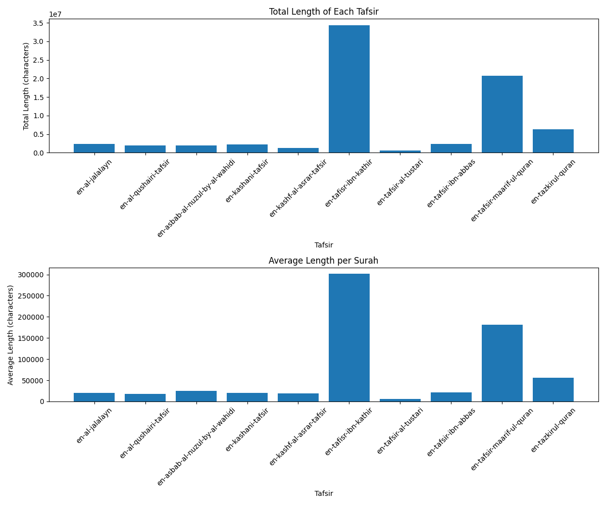

# Quran Tafsir Search Engine

A semantic search engine for Quran verses and their interpretations (Tafsir Ibn Kathir), with a user-friendly Streamlit interface.
i used Tafsir Ibn Kathir since its the largest of them all

# screenshots

## Features

- 🔍 Semantic search through Ibn Kathir's Tafsir
- 🎯 Accurate verse matching using FAISS similarity search
- 🔊 Audio recitation for each verse
- 📱 User-friendly Streamlit interface
- 🌐 Support for both Arabic text and English translations

## Installation

1. Clone the repository: 
